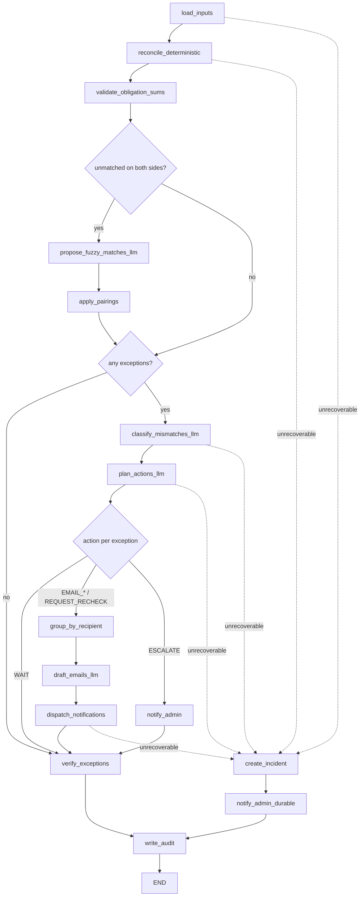

# PLAN — Agentic Retail Payment Reconciliation

> Status: **v2 (aligned with PRD v2)** · Owner: TBD · Last updated: 2026-06-08

This document is the single source of truth for the design and delivery of the
Retail Payment Reconciliation Agent. It is written to be read top-to-bottom by
an evaluator: section 1 explains the _what_, sections 2–5 the _how_, sections
6–8 the _delivery plan_ and _quality bar_.

---

## 1. Goal & scope

### 1.1 Problem

Retail stores receive payments through multiple channels (cash, UPI, cards,
wallets, net-banking, payment gateways). Settlements arrive on different
timelines from banks and payment gateways. Manually reconciling orders against
settlements is slow and error-prone.

### 1.2 What we build

A small **agentic system** that:

1. Accepts two uploaded files — `orders` and `settlements` (`.xlsx` or `.csv`),
   expanding each order's payment rows into discrete **obligations**.
2. Reconciles them deterministically, then uses an LLM to (a) propose fuzzy
   matches for residual unmatched rows, (b) classify and prioritise mismatches,
   (c) draft human-friendly notification emails.
3. Runs an **LLM planner** that selects a controlled next action per exception
   (`WAIT` / `EMAIL_STORE_MANAGER` / `EMAIL_PG` / `EMAIL_BANK` / `ESCALATE` /
   `REQUEST_RECHECK`), then a **verifier** that marks each exception resolved or
   still-open on the next run.
4. Sends notifications via email to the right party (Store Manager / Payment
   Gateway / Bank / Admin) based on the resolved recipient.
5. Persists an append-only audit trail, raises **incidents** (JSON) for
   unrecoverable failures, and notifies the admin through a durable,
   non-email-only channel.
6. Exposes telemetry and demonstrates production-grade resilience: retry with
   backoff, circuit breaker, idempotency, structured JSON logging, dry-run mode.

### 1.3 Explicitly out of scope

GST filing, SMS (DLT registration is a 3–5 day blocker in India),
authentication, multi-tenant data isolation, managed/networked database,
background workers, real money movement. (A single-replica **container deploy to
Azure Container Apps** for the demo **is** in scope — §6.7.)

### 1.4 Non-functional requirements

- Runs on a laptop with one command after `.env` is filled in.
- No paid services required for local/dev — every dependency has a free tier or a
  `mock` implementation; the full test suite runs offline.
- All AI calls are mockable.
- Logs are structured JSON suitable for piping to `jq` or a log aggregator.
- Code is type-annotated, linted, formatted, and CI-checked.
- **Deployable as a single container** to Azure Container Apps for a hosted demo
  (real Groq + real Resend); cloud secrets via Container Apps secrets, never
  committed.
- The container honours the platform `$PORT` (binds `0.0.0.0`); all writable
  state lives under one configurable `DATA_DIR` (default `data/runtime/`).
- Hosted-demo persistence is **ephemeral** (resets on restart) — by design;
  durability is a documented config change (mounted Azure Files).

---

## 2. Architecture

### 2.1 System view

```mermaid
flowchart LR
    U[User / Browser] -->|upload 2 files| API[FastAPI app]
    CLI[Typer CLI] --> API
    API --> P[Parsers]
    P --> AG[LangGraph Agent]
    AG --> LLM[(Groq LLM)]
    AG --> N[Notifier]
    N --> R[(Resend / SMTP / Mock)]
    AG --> DB[(SQLite: run / audit / notification log)]
    AG --> INC[(Incidents: JSON / JSONL)]
    INC --> ADM[Admin notify: JSONL + console + best-effort email]
    API --> DB
    API --> M["/metrics, /runs/&#123;id&#125;"]
```



### 2.2 Agent view (LangGraph state machine)



**Where the LLM actually decides things** (everything else is deterministic):
| Node | LLM role |
|---|---|
| `propose_fuzzy_matches_llm` | Look at unmatched orders + unmatched settlements; propose pairings with a confidence score and short rationale. |
| `apply_pairings` (deterministic) | Auto-apply pairings with `confidence ≥ 0.85`; emit `FUZZY_MATCH_REVIEW` mismatch (routed to Admin) for `0.5 ≤ confidence < 0.85`; discard the rest. |
| `classify_mismatches_llm` | Add `severity` (`routine` / `needs_review` / `high_value`) and confirm `recipient_role` for edge cases. |
| `plan_actions_llm` | Choose one action per exception from the allow-list (`WAIT` / `EMAIL_STORE_MANAGER` / `EMAIL_PG` / `EMAIL_BANK` / `ESCALATE` / `REQUEST_RECHECK`), constrained by SLA + business rules. Off-list / malformed output → deterministic `ESCALATE` fallback. |
| `draft_emails_llm` | Write a concise, retail-friendly subject + body summarising the mismatches for that recipient. |

Deterministic-only (never LLM): matching, amount math, obligation-sum checks,
`verify_exceptions`, incident severity, and audit writes.

The LLM is **never** in the matching path itself — keeping the system fast,
cheap, and deterministic where correctness matters most.

### 2.3 Tech choices (locked)

| Concern               | Choice                                                               | Rationale                                                               |
| --------------------- | -------------------------------------------------------------------- | ----------------------------------------------------------------------- |
| Language / runtime    | Python 3.11+                                                         | Mature ecosystem for Excel + AI agents                                  |
| Package / env         | `uv`                                                                 | Fast, reproducible, lockfile-first                                      |
| Web framework         | FastAPI                                                              | Type-safe, async-ready, OpenAPI built-in                                |
| Templates / UI        | Jinja2 + vanilla CSS                                                 | One stack, no JS toolchain                                              |
| Agent framework       | LangGraph                                                            | Explicit state machine, conditional edges, easy to test                 |
| LLM                   | Groq (`llama-3.3-70b-versatile`) via `langchain-groq`                | Free trial, low latency, no card needed                                 |
| Email                 | Resend (default) + SMTP (Gmail) + Mock                               | Free-tier-friendly, swappable via config                                |
| Excel parsing         | `pandas` + `openpyxl`                                                | Standard, handles `.xlsx` and `.csv`                                    |
| Persistence           | SQLite + SQLAlchemy 2                                                | Single file, append-only audit, real schema                             |
| Incidents             | JSON files + `incidents.jsonl`                                       | Durable failure record independent of SQLite/email                      |
| Validation            | Pydantic v2                                                          | Same models for API, parsing, LLM output                                |
| Logging               | `structlog` (JSON)                                                   | Contextvar binding for `run_id` correlation                             |
| Resilience            | `tenacity` + `pybreaker`                                             | Retry + circuit breaker, both battle-tested                             |
| Tests                 | `pytest` + `FakeListChatModel` + `MockNotifier`                      | Offline, deterministic, fast                                            |
| Lint / format / types | `ruff` + `ruff format` + `mypy --strict`                             | Fastest, single config in `pyproject.toml`                              |
| CI                    | GitHub Actions                                                       | Runs lint + type-check + tests on push/PR                               |
| Dispatch concurrency  | **Sequential**                                                       | Cleaner circuit-breaker demo; documented upgrade path                   |
| Container             | Docker (`python:3.11-slim`, multi-stage, uv, non-root)               | Reproducible image; cloud/local parity                                  |
| Hosted demo           | **Azure Container Apps** (single replica) + Azure Container Registry | Scale-to-one, HTTPS ingress, native secrets; cheap for demos            |
| Hosted notifier       | **Resend** (HTTPS API)                                               | Works from cloud (no SMTP port-25 block); real delivery to demo inboxes |

---

## 3. Data model

### 3.1 Input — `orders.xlsx` / `orders.csv`

| Column              | Type                | Required    | Notes                                                                                 |
| ------------------- | ------------------- | ----------- | ------------------------------------------------------------------------------------- |
| `order_id`          | str                 | yes         | Repeated across an order's payment rows; **not** unique                               |
| `order_date`        | date (`YYYY-MM-DD`) | yes         |                                                                                       |
| `store_id`          | str                 | yes         |                                                                                       |
| `customer_name`     | str                 | no          |                                                                                       |
| `customer_email`    | str                 | no          |                                                                                       |
| `amount`            | decimal             | yes         | Order **gross total**; identical on every row of the same order                       |
| `payment_type`      | enum                | yes         | `CASH` \| `UPI` \| `CARD` \| `NETBANKING` \| `WALLET`                                 |
| `payment_amount`    | decimal             | yes         | **This obligation's** amount (one row = one obligation)                               |
| `payment_gateway`   | enum/null           | conditional | Required when `payment_type != CASH`. One of `RAZORPAY` \| `PAYU` \| `CASHFREE`       |
| `gateway_txn_id`    | str/null            | conditional | Required when `payment_type != CASH`; unique per online obligation                    |
| `responsible_party` | enum/null           | no          | Optional **override** role: `STORE_MANAGER` \| `PAYMENT_GATEWAY` \| `BANK` \| `ADMIN` |
| `status`            | enum                | yes         | `PLACED` \| `CANCELLED` (only `PLACED` is reconciled)                                 |

> An order spans **one row per payment obligation** (e.g. part CARD + part CASH
> = two rows sharing `order_id` and `amount`). Each row reconciles independently;
> the rows' `payment_amount` values must sum to `amount` (§3.4 `ORDER_SUM_MISMATCH`).

### 3.2 Input — `settlements.xlsx` / `settlements.csv`

| Column            | Type     | Required | Notes                                                 |
| ----------------- | -------- | -------- | ----------------------------------------------------- |
| `settlement_id`   | str      | yes      | Unique within file                                    |
| `settlement_date` | date     | yes      |                                                       |
| `order_id`        | str/null | no       | May be blank — drives unmatched flow                  |
| `gateway_txn_id`  | str/null | no       | Preferred join key when present                       |
| `amount`          | decimal  | yes      | Gross amount                                          |
| `fee`             | decimal  | no       | Default 0                                             |
| `net_amount`      | decimal  | yes      | `amount - fee`                                        |
| `payment_type`    | enum     | yes      | Same enum as orders                                   |
| `source`          | enum     | yes      | `BANK` \| `RAZORPAY` \| `PAYU` \| `CASHFREE`          |
| `reference_id`    | str/null | no       | Bank/PG reference (e.g. UTR) for cash deposits / NEFT |

### 3.3 Matching algorithm (deterministic, SLA-blind)

Operates on **obligations** (one per order payment row, `status = PLACED`).

1. Build index of settlements by `gateway_txn_id` (skip nulls).
2. For each online obligation with a `gateway_txn_id`, look it up — candidate pair.
3. Build index of remaining settlements by `(order_id, payment_type)` (skip null `order_id`).
4. For each still-unmatched obligation, look up by `(order_id, payment_type)` —
   candidate pair (disambiguates split CASH/CARD/UPI rows on one order).
5. For each candidate pair, compare amounts within `amount_tolerance` to assign a
   final status (§3.4a).
6. Anything still unmatched on either side flows into the exception pipeline;
   residual unmatched orders **and** settlements may first enter the LLM
   fuzzy-match step (§2.2) before final classification.

SLA is **not** used here — it only influences the planner (§3.4 / §6).

### 3.4 Exception taxonomy & recipient routing

#### 3.4a Obligation status (deterministic)

| Status              | Definition                                                                           |
| ------------------- | ------------------------------------------------------------------------------------ | ----------------- | -------------------- |
| `MATCHED`           | Exactly one settlement satisfies the obligation and `                                | expected − actual | ≤ amount_tolerance`. |
| `PARTIALLY_MATCHED` | Matched by key but settled **less** than expected (`actual < expected − tolerance`). |
| `EXCESS`            | Matched by key but settled **more** than expected (`actual > expected + tolerance`). |
| `DUPLICATE`         | Duplicate `settlement_id`, or two settlements satisfy the same obligation key.       |
| `UNMATCHED`         | Obligation with no settlement, or settlement with no obligation.                     |

#### 3.4b Reason → recipient routing

| `reason`               | Trigger                                                                                                                                                                                                                                  | Default recipient role(s)             |
| ---------------------- | ---------------------------------------------------------------------------------------------------------------------------------------------------------------------------------------------------------------------------------------- | ------------------------------------- |
| `CASH_MISSING`         | `CASH`, `PLACED`, no settlement                                                                                                                                                                                                          | Store Manager                         |
| `ONLINE_MISSING`       | online obligation, no settlement, **SLA breached**                                                                                                                                                                                       | Payment Gateway (order's gateway)     |
| `LATE_SETTLEMENT`      | online obligation unmatched but **within** grace                                                                                                                                                                                         | Payment Gateway (planner may `WAIT`)  |
| `AMOUNT_SHORT`         | `PARTIALLY_MATCHED`                                                                                                                                                                                                                      | Payment Gateway **and** Store Manager |
| `AMOUNT_EXCESS`        | `EXCESS` (over-settled)                                                                                                                                                                                                                  | Payment Gateway **and** Store Manager |
| `DUPLICATE_SETTLEMENT` | `DUPLICATE`                                                                                                                                                                                                                              | Payment Gateway **and** Bank          |
| `UNMATCHED_SETTLEMENT` | settlement with no order (fuzzy step rejected)                                                                                                                                                                                           | Bank **and** Payment Gateway          |
| `ORDER_SUM_MISMATCH`   | **order-level data-quality**: `sum(payment_amount) != amount` (`expected` = order total, `actual` = row sum; `status` reuses `EXCESS`/`PARTIALLY_MATCHED` for over/under, `reason` is authoritative); independent of settlement matching | Store Manager                         |
| `FUZZY_MATCH_REVIEW`   | LLM pairing `0.5 ≤ confidence < 0.85`                                                                                                                                                                                                    | Admin                                 |

Routing precedence: the reason gives the **default** role; an order row's
`responsible_party`, when present, **overrides** it.

Each exception carries a stable
`mismatch_key = sha1(reason|order_id|settlement_id|payment_type|recipient_role)`
used as the idempotency primary key (§6.3). For order-level exceptions (e.g.
`ORDER_SUM_MISMATCH`) `settlement_id` is null and `payment_type` is `*`.

### 3.5 Persistence schema (SQLite + JSON)

| Store              | Backing                        | Purpose                                                                          | Key columns                                                                                                                                                                                      |
| ------------------ | ------------------------------ | -------------------------------------------------------------------------------- | ------------------------------------------------------------------------------------------------------------------------------------------------------------------------------------------------ |
| `run_log`          | SQLite                         | One row per agent invocation                                                     | `id (uuid)`, `started_at`, `finished_at`, `status`, `input_hash`, `orders_count`, `settlements_count`, `summary_json`                                                                            |
| `audit_log`        | SQLite                         | Append-only **typed** event stream per run                                       | `id`, `run_id`, `ts`, `order_id` (nullable), `event_type`, `action`, `reason`, `status`, `details`                                                                                               |
| `notification_log` | SQLite                         | One row per email attempt                                                        | `id`, `run_id`, `mismatch_key`, `recipient_role`, `recipient_email`, `channel`, `status` (`sent`/`failed`/`skipped`), `error`, `sent_at` — **unique index on `(mismatch_key, recipient_email)`** |
| `exception_log`    | SQLite                         | Open/resolved exception lifecycle across runs (feeds verifier + planner history) | `mismatch_key (pk)`, `run_id`, `reason`, `status` (`open`/`resolved`/`escalated`/`awaiting_recheck`), `first_seen`, `last_seen`                                                                  |
| incidents          | JSON files + `incidents.jsonl` | One record per unrecoverable failure                                             | `incident_id`, `run_id`, `severity`, `status`, `failure_type`, `root_cause`, `ts`, `remediation`                                                                                                 |
| mock outbox        | `mock_outbox.jsonl`            | Emails captured in mock/dry-run mode                                             | —                                                                                                                                                                                                |

The `notification_log` unique index turns "don't double-notify" from application
logic into a database invariant. `run_log.input_hash =
sha256(orders_bytes + settlements_bytes)` enables run-level idempotency (§6.3).

---

## 4. Repo layout (structured for review)

```
JioAgenticDemo/
├── .editorconfig                    # consistent whitespace across editors
├── .env.example                     # all env vars with safe defaults
├── .gitattributes                   # text=auto, lockfile linguist hints
├── .github/
│   ├── workflows/
│   │   └── ci.yml                   # lint -> type-check -> tests
│   ├── ISSUE_TEMPLATE/
│   │   └── bug_report.md
│   └── pull_request_template.md
├── .gitignore                       # .venv, .env, data/runtime/*, __pycache__, ...
├── .pre-commit-config.yaml          # ruff, ruff-format, mypy, end-of-file-fixer
├── CHANGELOG.md                     # Keep-a-Changelog format
├── CONTRIBUTING.md                  # how to run, test, lint, propose changes
├── LICENSE                          # MIT
├── PLAN.md                          # this file
├── README.md                        # how to run + test + design overview
├── pyproject.toml                   # [project], deps, ruff, mypy, pytest config
├── uv.lock                          # committed
├── Dockerfile                       # multi-stage python:3.11-slim + uv, non-root
├── .dockerignore                    # slim image (.venv, .git, data/runtime, tests)
├── deploy/
│   └── azure-container-app.md       # `az containerapp up` + secrets/env wiring
├── config/
│   └── settings.yaml                # recipients, thresholds, default notifier
├── data/
│   ├── samples/                     # checked-in sample files
│   │   ├── orders_sample.xlsx
│   │   ├── orders_sample.csv
│   │   ├── settlements_sample.xlsx
│   │   └── settlements_sample.csv
│   └── runtime/                     # .gitkeep only; SQLite + mock outbox land here
├── docs/
│   ├── architecture.md              # expanded mermaid + module responsibilities
│   ├── excel_schema.md              # column-by-column reference
│   ├── resilience.md                # retry / breaker / idempotency walkthrough
│   ├── telemetry.md                 # log fields, /metrics shape, LangSmith opt-in
│   └── deployment.md                # Azure Container Apps deploy + secrets/env
├── scripts/
│   └── generate_sample_data.py      # deterministic sample generator
├── src/
│   └── reconcile/
│       ├── __init__.py              # package version
│       ├── __main__.py              # `python -m reconcile` -> Typer CLI
│       ├── app.py                   # FastAPI factory
│       ├── cli.py                   # Typer commands: serve, run, demo, init-db
│       ├── config.py                # AppSettings (env) + RecipientsConfig (YAML)
│       ├── logging_setup.py         # structlog JSON + run_id contextvar
│       ├── db.py                    # engine, Session, init_db
│       ├── models/
│       │   ├── __init__.py
│       │   ├── domain.py            # Pydantic: Order, Obligation, Settlement, Match, Exception, PlannerDecision, Incident
│       │   └── db_models.py         # SQLAlchemy ORM: run/audit/notification/exception logs
│       ├── parsers/
│       │   ├── __init__.py
│       │   ├── orders.py            # read_orders(source) -> list[Order]
│       │   └── settlements.py
│       ├── reconciliation/
│       │   ├── __init__.py
│       │   ├── obligations.py       # explode orders -> obligations + sum validation
│       │   ├── matcher.py           # reconcile(obligations, settlements) -> statuses
│       │   ├── sla.py               # sla_status(obligation, as_of_date, config)
│       │   └── rules.py             # classify_by_rule(exception, config) -> reason + recipient
│       ├── agent/
│       │   ├── __init__.py
│       │   ├── state.py             # ReconciliationState TypedDict
│       │   ├── graph.py             # build_graph() incl. planner/verifier/incident edges
│       │   ├── nodes.py             # load, reconcile, sums, fuzzy, classify, plan, route, draft, dispatch, verify, incident
│       │   ├── planner.py           # plan_actions() -> allow-listed action + ESCALATE fallback
│       │   ├── verifier.py          # verify_exceptions() -> open/resolved across runs
│       │   ├── prompts.py           # CLASSIFY_PROMPT, FUZZY_PROMPT, PLAN_PROMPT, DRAFT_PROMPT
│       │   └── llm.py               # get_llm() Groq + MOCK_LLM path + retry + call budget
│       ├── notifications/
│       │   ├── __init__.py
│       │   ├── base.py              # NotifierProtocol, SendRequest, SendResult
│       │   ├── resend_notifier.py
│       │   ├── smtp_notifier.py
│       │   ├── mock_notifier.py     # writes JSONL to data/runtime/mock_outbox.jsonl
│       │   ├── factory.py           # get_notifier(settings)
│       │   ├── circuit_breaker.py   # pybreaker wrapper + state-change logging
│       │   └── retry.py             # tenacity decorators
│       ├── audit/
│       │   ├── __init__.py
│       │   ├── repository.py        # AuditRepository: log_event, get_run, ...
│       │   └── idempotency.py       # already_notified / mark_notified + input_hash
│       ├── incidents/
│       │   ├── __init__.py
│       │   ├── store.py             # write incident JSON + incidents.jsonl
│       │   ├── severity.py          # deterministic severity rules (no LLM)
│       │   └── admin_notify.py      # durable channel: JSONL + console + best-effort email
│       └── api/
│           ├── __init__.py
│           ├── routes.py            # GET /, POST /reconcile, GET /runs/{id}, /metrics, /healthz
│           ├── middleware.py        # run_id binding, request logging
│           ├── templates/
│           │   ├── base.html
│           │   ├── upload.html
│           │   └── results.html
│           └── static/
│               └── style.css
└── tests/
    ├── __init__.py
    ├── conftest.py                  # fixtures: tmp sqlite, fake llm, mock notifier
    ├── fixtures/                    # small CSV fixtures
    ├── unit/
    │   ├── test_parsers.py
    │   ├── test_obligations.py
    │   ├── test_matcher.py
    │   ├── test_sla.py
    │   ├── test_rules.py
    │   ├── test_planner.py
    │   ├── test_verifier.py
    │   ├── test_incidents.py
    │   ├── test_idempotency.py
    │   ├── test_circuit_breaker.py
    │   └── test_notifiers.py
    ├── integration/
    │   ├── test_agent_graph.py
    │   └── test_api.py
    └── e2e/
        └── test_demo_flow.py        # uploads samples -> asserts statuses, actions, emails, incidents
```

### 4.1 Why this layout (good-practice highlights)

- **`src/` layout** prevents the "I imported from the source tree by accident"
  bug class — tests run against the installed package.
- **Single `pyproject.toml`** holds project metadata, dependencies, and all
  tool config (ruff, mypy, pytest, coverage) — no scattered `setup.cfg` /
  `mypy.ini` / `pytest.ini`.
- **`tests/` mirrors `src/`** with `unit / integration / e2e` tiers — reviewers
  can see test depth at a glance and skip slow tests with `-m "not e2e"`.
- **`docs/`** keeps long-form explanations out of `README.md` (which stays a
  10-minute on-ramp).
- **`config/settings.yaml` vs `.env`** — secrets in env, non-secret demo data
  (recipient emails, thresholds) in YAML and safe to commit.
- **`scripts/generate_sample_data.py`** makes sample fixtures regeneratable
  rather than mystery binaries.
- **`.github/workflows/ci.yml`** signals quality from the repo landing page.

---

## 5. Configuration reference

### 5.1 `.env` (secrets — never commit)

```dotenv
# LLM
GROQ_API_KEY=gsk_...
LLM_MODEL=llama-3.3-70b-versatile
MOCK_LLM=false                 # true -> canned, schema-valid responses (offline)
MAX_LLM_CALLS=200              # per-run budget; planner/classify cached by mismatch_key

# Notifier provider: resend | smtp | mock
# local/tests default = mock; hosted Azure demo = resend (real delivery)
NOTIFIER=mock

# Resend
RESEND_API_KEY=re_...
RESEND_FROM=alerts@yourdomain.com

# SMTP (Gmail App Password)
SMTP_HOST=smtp.gmail.com
SMTP_PORT=587
SMTP_USER=you@gmail.com
SMTP_PASSWORD=app-password
SMTP_FROM=you@gmail.com

# App
DATA_DIR=data/runtime           # single writable dir: SQLite, incidents, outbox
DATABASE_URL=sqlite:///data/runtime/reconcile.db
LOG_LEVEL=INFO
PORT=8000                       # platform may inject this; app binds 0.0.0.0:$PORT

# Hosted-demo hardening (optional)
DEMO_ACCESS_KEY=                # if set, POST /reconcile requires this key

# Recipient overrides (optional) — precedence over config/settings.yaml so real
# inboxes are set per-deployment without committing them to the repo
RECIPIENT_STORE_MANAGER=
RECIPIENT_ADMIN=
RECIPIENT_BANK=
RECIPIENT_PG_RAZORPAY=
RECIPIENT_PG_PAYU=
RECIPIENT_PG_CASHFREE=

# Optional tracing
LANGSMITH_API_KEY=
LANGSMITH_PROJECT=jio-reconcile
LANGSMITH_TRACING=false
```

### 5.2 `config/settings.yaml` (non-secret demo config — committed)

```yaml
# Placeholders for local/dev. The hosted demo overrides these with real inboxes
# via RECIPIENT_* env vars (precedence: env > yaml) — real emails stay out of git.
recipients:
  store_manager: store-manager@demo.local
  admin: admin@demo.local
  bank: bank-ops@demo.local
  payment_gateways:
    RAZORPAY: razorpay-support@demo.local
    PAYU: payu-support@demo.local
    CASHFREE: cashfree-support@demo.local

reconciliation:
  amount_tolerance: 1.00 # rupee tolerance for amount statuses
  sla_grace_days: # per-payment-type SLA; planner may WAIT within grace
    CASH: 1
    UPI: 1
    CARD: 2
    NETBANKING: 2
    WALLET: 1

planner:
  allowed_actions:
    [WAIT, EMAIL_STORE_MANAGER, EMAIL_PG, EMAIL_BANK, ESCALATE, REQUEST_RECHECK]
  off_list_fallback: ESCALATE # used when LLM returns an unknown/malformed action

fuzzy_match:
  enabled: true
  auto_apply_threshold: 0.85 # >= this -> auto-pair
  review_threshold: 0.50 # >= this and < auto -> email Admin

resilience:
  email_retry_attempts: 3
  email_retry_min_seconds: 1
  email_retry_max_seconds: 8
  circuit_breaker_fail_max: 3
  circuit_breaker_reset_seconds: 30

incidents:
  dir: data/runtime/incidents # one JSON per incident + incidents.jsonl
  admin_email_best_effort: true # always write JSONL + console; email is best-effort
```

---

## 6. Resilience, telemetry, security

### 6.1 Retry (`tenacity`)

- `retry_email` — `stop_after_attempt(3)`, exponential backoff `1s → 8s`, only
  on `TransientNotifyError` (network/5xx). Permanent errors (4xx) raise
  immediately.
- `retry_llm` — same shape, only on `LLMTransientError`.

### 6.2 Circuit breaker (`pybreaker`)

- Wraps each notifier's `send` method.
- `fail_max=3`, `reset_timeout=30s` (configurable).
- State-change listener writes a structured log line and bumps a counter
  surfaced at `/metrics`.
- When open: `send` returns `SendResult(status="skipped", reason="circuit_open")`
  instead of raising — the agent records it and moves on.

### 6.3 Idempotency

- **Action key** = `(mismatch_key, recipient_email)` where
  `mismatch_key = sha1(reason|order_id|settlement_id|payment_type|recipient_role)`.
  Enforced by a SQLite **unique index** in `notification_log`.
- **Run key** = `input_hash = sha256(orders_bytes + settlements_bytes)` stored on
  `run_log`; a rerun with the same hash reuses prior decisions.
- Application-side check first (cheap), DB constraint as backstop.
- Re-running the same files produces zero duplicate emails; second-run entries
  are logged as `status="skipped" reason="duplicate"`.

### 6.4 Logging & telemetry

- `structlog` JSON renderer, ISO timestamps, fields always include
  `ts, level, event, run_id, step`.
- Per-request middleware binds a fresh UUID `run_id` for HTTP runs; CLI uses
  the same binder.
- `GET /metrics` returns JSON:
  ```json
  {
    "runs_total": 12,
    "exceptions_by_reason": {
      "CASH_MISSING": 4,
      "AMOUNT_SHORT": 2,
      "ONLINE_MISSING": 1
    },
    "planner_actions": { "WAIT": 3, "EMAIL_PG": 5, "ESCALATE": 1 },
    "notifications": { "sent": 18, "skipped": 3, "failed": 0 },
    "incidents": { "open": 1, "resolved": 0 },
    "llm_calls": 24,
    "circuit_breaker": { "state": "closed", "fail_count": 0 }
  }
  ```
- Telemetry events cover every stage: workflow start/end, reconcile start/end,
  exception created, planner invoked/completed, tool invoked + success/failure,
  LLM prompt sent / response / timeout, retries, breaker state change, incident
  created, admin notified — each carrying `run_id, event_type, component,
entity_id, status, error_details`.
- Optional LangSmith tracing toggled by `LANGSMITH_TRACING=true`.

### 6.5 Security

- No secrets in repo; `.env.example` only.
- File uploads capped (e.g. 5 MB), MIME-checked, parsed in-memory only.
- LLM output is treated as untrusted: structured outputs are validated by
  Pydantic before use; email bodies are plain-text only (no HTML injection
  surface).
- SQL via SQLAlchemy ORM (no string concatenation).
- `dry_run=true` short-circuits the notifier so demos can't accidentally email
  real addresses.
- Secrets never appear in logs, telemetry, or admin notifications.
- **Hosted public demo:** recipients are fixed by config/`RECIPIENT_*` env (users
  cannot make the agent email arbitrary addresses); the optional
  `DEMO_ACCESS_KEY` gates `POST /reconcile`; `MAX_LLM_CALLS` + upload caps bound
  Groq/Resend spend; the app runs as a **non-root** container user; tear the
  Container App down after review.
- Cloud secrets (`GROQ_API_KEY`, `RESEND_API_KEY`) live in **Azure Container Apps
  secrets**, surfaced as env vars — never baked into the image or repo.

### 6.6 Incidents & administrator notification

- An **incident** is an _unrecoverable system failure_ (bad input, LLM/email
  exhausted after retries + open breaker, planner crash, config corruption,
  unsupported payment type). It is **distinct** from a planner `ESCALATE`, which
  routes a _valid_ exception to a human.
- `incidents/store.py` writes one `data/runtime/incidents/<id>.json` **and**
  appends to `incidents.jsonl`. Severity is assigned by deterministic rules in
  `incidents/severity.py` (never the LLM). States: `OPEN → IN_PROGRESS →
RESOLVED`.
- `incidents/admin_notify.py` uses a **durable, non-email-only** channel: it
  **always** appends to `incidents.jsonl` and prints a structured stderr line
  (CLI exits non-zero), **then** best-effort emails the admin. If email is the
  failing component, the durable record still reaches the admin.
- Row-level failures never abort the run — the agent records a per-record
  incident and continues processing valid records.
- Notification payload: `incident_id, run_id, order_id?, failure summary,
timestamp, recovery attempts, remediation`. Secrets are never included.

### 6.7 Deployment (Azure Container Apps)

- **Image:** multi-stage `Dockerfile` (`python:3.11-slim` + `uv sync --no-dev`),
  runs as a **non-root** user; `CMD` starts `uvicorn` bound to `0.0.0.0:${PORT}`.
- **Build & deploy:** `az containerapp up --source .` (ACR build + deploy) for the
  one-shot path; explicit ACR build + `az containerapp create` is documented in
  `deploy/azure-container-app.md`.
- **Ingress:** external HTTPS, `targetPort = 8000`; `/healthz` as the probe.
- **Scale:** pinned to a **single replica** (`--min-replicas 1 --max-replicas 1`)
  — SQLite is single-writer; multi-replica needs Postgres (§10).
- **Secrets/env:** `GROQ_API_KEY`, `RESEND_API_KEY`, `RESEND_FROM`,
  `NOTIFIER=resend`, `RECIPIENT_*`, optional `DEMO_ACCESS_KEY` set as Container
  Apps secrets/env — never baked into the image.
- **State:** `DATA_DIR` is the container's ephemeral disk; data resets on restart
  (acceptable per §1.4). Durable demo = mount Azure Files at `DATA_DIR`.
- **Logs:** structlog JSON → stdout → Container Apps log stream / Log Analytics.

---

## 7. Delivery plan (phases)

Each phase ends with a runnable, committed checkpoint.

### Phase 1 — Scaffold & tooling _(blocks everything)_

1. `uv init`, Python 3.11, src layout, `pyproject.toml` with `[project]` table.
2. Tooling: `ruff`, `mypy --strict` on `src/`, `pytest` + `coverage` in
   `pyproject.toml`. Pre-commit hooks.
3. `.gitignore`, `.editorconfig`, `.env.example`, `LICENSE` (MIT),
   `CHANGELOG.md`, `CONTRIBUTING.md`, README skeleton.
4. `.github/workflows/ci.yml` — install, lint, type-check, test.

### Phase 2 — Data layer

1. Pydantic domain models with `mismatch_key` helper.
2. Parsers for `.xlsx` and `.csv` with friendly schema errors (row numbers).
3. SQLAlchemy models + `init_db` + unique index on `notification_log`.
4. `pydantic-settings` config: env + YAML.
5. `structlog` JSON setup + `run_id` contextvar.
6. `scripts/generate_sample_data.py` — deterministic seed: orders with split
   obligations (part CASH + part CARD), settlements covering every status and
   reason (incl. `EXCESS`, `DUPLICATE`, `ORDER_SUM_MISMATCH`) plus 3 fuzzy-match
   candidates.

### Phase 3 — Reconciliation core

1. `obligations.explode()` (orders → obligations) + sum validation
   (`ORDER_SUM_MISMATCH`).
2. `matcher.reconcile(obligations, settlements)` → 5-status classification.
3. `sla.sla_status(obligation, as_of_date, config)` (per-payment-type grace).
4. `rules.classify_by_rule(exception, config)` → reason + recipient role
   (with `responsible_party` override).
5. Table-driven unit tests for every status + reason + happy paths.

### Phase 4 — Agent

1. `ReconciliationState` TypedDict.
2. Prompts: classify, fuzzy-match, **plan**, draft.
3. Node functions (load, reconcile, sums, fuzzy, classify, **plan**, route,
   draft, dispatch, **verify**, **incident**); LLM nodes use
   `with_structured_output(Pydantic)` + `MAX_LLM_CALLS` budget.
4. `planner.plan_actions()` with allow-list + `ESCALATE` fallback;
   `verifier.verify_exceptions()` reading the `exception_log` across runs.
5. `build_graph()` with the conditional edges from §2.2 (fuzzy, exceptions,
   action routing, incident).
6. Graph tests with `FakeListChatModel` + `MockNotifier` (incl. off-list action
   → ESCALATE, WAIT-within-SLA).

### Phase 5 — Notifications, incidents & resilience

1. `NotifierProtocol` + Resend / SMTP / Mock + factory.
2. `pybreaker` wrapper with state-change listener.
3. `tenacity` decorators distinguishing transient vs permanent.
4. Idempotency repo (+ `input_hash`) + audit repo + `exception_log` repo.
5. `incidents/` — `store` (JSON + JSONL), deterministic `severity`,
   `admin_notify` (durable channel).
6. Unit tests for breaker open/short-circuit, skip-on-duplicate, incident
   creation, and admin-notify-when-email-down.

### Phase 6 — API & UI

1. FastAPI factory + startup hook to create DB.
2. Routes: `GET /`, `POST /reconcile` (multipart + `dry_run`), `GET /runs/{id}`,
   `GET /metrics`, `GET /healthz`.
3. Jinja2 templates: `upload.html`, `results.html` (summary cards, per-reason
   exception tables, planner action per exception, incidents panel, expandable
   email previews, link to audit log).
4. Middleware for `run_id` binding and request logging.
5. Typer CLI: `serve`, `run`, `demo`, `init-db`.
6. API tests via `TestClient`.

### Phase 7 — Tests, docs, polish

1. End-to-end test: upload samples → assert all statuses/reasons → assert
   planner actions → assert notifications dispatched → assert audit rows,
   incident creation, and idempotent rerun.
2. README (10-minute on-ramp) + `docs/architecture.md`, `docs/excel_schema.md`,
   `docs/resilience.md`, `docs/telemetry.md`.
3. Final smoke test: `uv run reconcile demo --notifier mock`.
4. `git init`, initial commit, push to GitHub (user runs `gh repo create`).

### Phase 8 — Containerize & deploy (Azure Container Apps)

1. `Dockerfile` (multi-stage, non-root, `uvicorn` on `$PORT`) + `.dockerignore`.
2. Local parity: `docker build` then
   `docker run -p 8000:8000 --env-file .env` — `/healthz` green, upload works.
3. `DATA_DIR` + `$PORT` wiring; confirm every write lands under `DATA_DIR`.
4. Optional `DEMO_ACCESS_KEY` gate on `POST /reconcile`; `RECIPIENT_*` overrides.
5. `az containerapp up --source .`; set Groq/Resend/recipients as ACA
   secrets/env; single replica; external ingress on `targetPort 8000`.
6. Smoke-test the hosted URL; trigger one real Resend email to a demo inbox.
7. `docs/deployment.md` + README "Hosted demo" and "Deploy your own" sections.

> Phases 2/3 and 4/5 can run in parallel after Phase 1 lands.

---

## 8. Acceptance criteria

A reviewer should be able to verify each item in order:

1. `uv sync` succeeds on a fresh clone with Python 3.11.
2. `uv run pytest -q` — all tests pass; coverage on `reconciliation/`,
   `agent/` (planner/verifier), `incidents/`, and `notifications/` ≥ 90%.
3. `uv run ruff check .` and `uv run mypy src` — both clean.
4. `uv run reconcile demo --notifier mock` exits 0; produces at least one of
   each status (`MATCHED/PARTIALLY_MATCHED/EXCESS/DUPLICATE/UNMATCHED`) and an
   `ORDER_SUM_MISMATCH`, writes rows to `run_log` / `audit_log` /
   `notification_log` / `exception_log`, and a planner action per exception.
5. `uv run reconcile serve` → open `http://localhost:8000` → upload the two
   sample files → results page renders per-reason exception tables, the planner
   action per exception, an incidents panel, and a visible email preview per
   recipient.
6. Force-fail Resend (invalid key, `NOTIFIER=resend`): after 3 failed attempts
   the breaker opens; subsequent calls return `skipped:circuit_open` within
   milliseconds; an **incident** is created and the admin record is written to
   `incidents.jsonl` even though email is down; state visible in `/metrics`.
7. Re-run the same file pair: second run's `notification_log` entries are all
   `status="skipped" reason="duplicate"` — no duplicate emails (run also
   short-circuits on matching `input_hash`).
8. Planner robustness: a forced off-list LLM action is recorded and falls back
   to `ESCALATE`; a within-SLA online gap yields `WAIT` (no email).
9. `--dry-run` sends nothing real (mock outbox unchanged for real providers).
10. `uv run reconcile serve | jq` — every line is valid JSON containing
    `run_id` and `step`.
11. `GET /metrics` totals match SQLite row counts and incident JSONL counts.
12. README walkthrough by a first-time reader produces a working demo in under
    10 minutes.
13. GitHub Actions CI is green on `main`.
14. `docker build` succeeds; `docker run -p 8000:8000 --env-file .env` serves
    `/healthz` = ok and the upload UI; the container honours `$PORT` and runs as
    a non-root user.
15. `az containerapp up --source .` yields a reachable HTTPS URL; `/healthz` is
    green on Azure; secrets are set as Container Apps secrets (not in the image).
16. On the hosted demo (`NOTIFIER=resend`), one upload delivers a real email to a
    configured demo inbox and records it in `notification_log`.

---

## 9. Risks & open questions

| #   | Risk                                                                        | Mitigation                                                                                                                                                  |
| --- | --------------------------------------------------------------------------- | ----------------------------------------------------------------------------------------------------------------------------------------------------------- |
| 1   | Groq free-tier rate limits during a demo                                    | `retry_llm` with backoff; `MAX_LLM_CALLS` budget + planner/classify cache per `mismatch_key`; `MOCK_LLM=true` offline path; documented `LLM_MODEL` override |
| 2   | LLM proposes a wrong high-confidence fuzzy match → auto-applied incorrectly | Conservative `auto_apply_threshold = 0.85`; every auto-pair recorded in audit with rationale; reversible via re-run (idempotency dedupes notifications)     |
| 3   | Excel files with surprise columns / encodings                               | Pydantic schema validation with row-level errors surfaced in the UI                                                                                         |
| 4   | Resend free-tier exhaustion                                                 | `MOCK` notifier is default; SMTP fallback documented                                                                                                        |
| 5   | Reviewer can't get Groq key                                                 | `MOCK_LLM=true` env path returns canned responses so the full pipeline is exercisable offline                                                               |
| 6   | Resend needs a verified domain for real delivery to arbitrary inboxes       | Verify a domain and set `RESEND_FROM` on it; for the demo send to inboxes you control; `mock` notifier stays the zero-setup fallback                        |
| 7   | Public hosted URL with live keys (quota abuse / unwanted email)             | `DEMO_ACCESS_KEY` gate, fixed recipients, `MAX_LLM_CALLS` + upload caps, tear the Container App down after review                                           |

### Resolved decisions (aligned with PRD v2)

1. **Late-settlement / SLA — SHIP IT.** Per-payment-type `sla_grace_days` gate
   the planner's `WAIT`; `age_days` uses an overridable `as_of_date` (`--as-of`)
   so fixtures stay deterministic. _(Was "defer" in v1; reversed per PRD §9.6.)_
2. **Fuzzy-match handling — notify-only.** Admin gets a `FUZZY_MATCH_REVIEW`
   email; the approve/reject callback endpoint remains next-step (§10).

### Open questions (still to confirm)

3. **GitHub repo visibility** — public or private with reviewer invite?
   _Recommendation: public; easier for evaluators._

---

## 10. Future work (post-interview)

- Admin approve/reject HTTP callback for `FUZZY_MATCH_REVIEW`.
- Parallel notification dispatch via `asyncio.gather`.
- Background worker (Celery / RQ / arq) for large file uploads.
- Real database (Postgres) + Alembic migrations — unlocks multi-replica
  scale-out on Container Apps (SQLite is single-writer today).
- Durable hosted state: mount Azure Files at `DATA_DIR`, or move audit/incidents
  to managed storage.
- CI/CD: GitHub Actions → ACR build → `az containerapp update` on push to `main`.
- AuthN/Z (OIDC) for the web UI, multi-tenant data isolation.
- WhatsApp via Twilio sandbox (no DLT needed) as an additional channel.
- Dashboard with historical run charts.

---

_End of plan._
