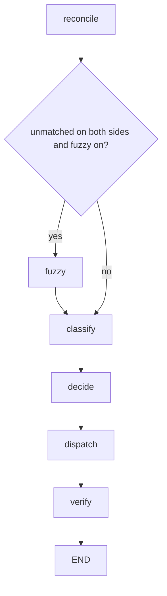

# ReconcileFlow Agent

> An agentic retail payment-reconciliation system. Upload an **orders** file and a
> **settlements** file; the agent reconciles them deterministically, uses an LLM to
> decide what to do about each mismatch, emails the right stakeholder, and records a
> complete audit trail — with circuit breaking, retries, idempotency, and structured
> telemetry throughout.

[](https://github.com/ktnvaish/retail-reconciliation-agent/actions/workflows/ci.yml)


**🚀 Live demo:** <https://reconcileflow.niceforest-73b0e6ad.centralindia.azurecontainerapps.io/>
&nbsp;·&nbsp; running on Azure Container Apps with **real Groq LLM + real Resend email**.
Open it, click **Run sample data**, and watch the agent reconcile, decide, and dispatch.

**📐 Design docs:** the product requirements and delivery plan behind this build live
in [docs/PRD.md](docs/PRD.md) and [docs/PLAN.md](docs/PLAN.md).

---

## What it does

Finance/ops teams reconcile daily orders against bank/payment-gateway settlements
by hand. ReconcileFlow automates it:

1. **Parse** two uploaded spreadsheets (`.xlsx` or `.csv`).
2. **Reconcile** deterministically — match by transaction id, then by
   `(order_id, payment_type)`; compare amounts.
3. **Fuzzy-match** residual rows with the LLM (auto-apply high confidence; route
   medium confidence to an admin for review).
4. **Decide** a severity + next action per exception (the LLM proposes; a planner
   enforces an allow-list).
5. **Notify** the right stakeholder by email (store manager / payment gateway /
   bank / admin).
6. **Record** an append-only audit trail, raise **incidents** on unrecoverable
   failures, and expose **metrics**.

It is **deterministic where correctness matters** (matching, amounts, audit,
incident severity) and **agentic where judgement helps** (fuzzy matches, action
choice, email drafting).

## Architecture

```mermaid
flowchart LR
    U[Browser / CLI] -->|2 files| API[FastAPI]
    API --> P[Parsers]
    P --> AG[LangGraph agent]
    AG --> LLM[(Groq LLM / mock)]
    AG --> N[NotificationService]
    N --> R[(Resend / SMTP / Mock)]
    AG --> DB[(SQLite: run/audit/notification/exception)]
    AG --> INC[(Incidents JSON/JSONL)]
    API --> M["/metrics, /runs/&#123;id&#125;"]
```



The agent is a LangGraph state machine:



See [docs/architecture.md](docs/architecture.md) for module responsibilities.

## Quick start

**Prerequisites:** Python 3.11+ and [uv](https://docs.astral.sh/uv/)
(`pip install uv`).

```bash
# 1. Install dependencies (creates .venv, uses the committed lockfile)
uv sync --extra dev

# 2. (Optional) configure — defaults run fully offline (MOCK_LLM + mock email)
cp .env.example .env

# 3. Run the agent against bundled sample data
uv run reconcile demo

# 4. Or launch the web app and open http://localhost:8000
uv run reconcile serve

# 5. Run the tests
uv run pytest
```

With the defaults (`MOCK_LLM=true`, `NOTIFIER=mock`) the whole pipeline runs
**offline** — no API keys required. "Sent" emails are captured to
`data/runtime/mock_outbox.jsonl`.

## Using the web UI

`uv run reconcile serve`, then open <http://localhost:8000>:

- **Upload** an orders file and a settlements file (or click **Run sample data**).
- Toggle **Dry run** to compute and preview emails without sending.
- The **results page** shows summary cards, a per-exception table (reason,
  amounts, SLA, severity, chosen action), and expandable email previews.
- Follow the **audit JSON** link, or hit `GET /metrics`.

## Using the CLI

```bash
uv run reconcile demo                       # run against bundled samples
uv run reconcile demo --dry-run             # preview without sending
uv run reconcile run orders.xlsx settlements.xlsx --as-of 2026-06-08
uv run reconcile serve --port 8000          # start the web app
uv run reconcile init-db                    # create the SQLite schema
```

(Equivalent: `python -m reconcile <command>`.)

## Input file schema

We define the formats; both `.xlsx` and `.csv` are accepted. Bundled examples are
in [data/samples/](data/samples), and the full column-by-column reference (types,
required/optional, enums, validation rules) is in
[docs/excel_schema.md](docs/excel_schema.md).

In short:

- **Orders** — one row per *payment obligation*, so an order may span multiple
  rows (e.g. part CARD + part CASH). Key columns: `order_id`, `order_date`,
  `amount` (order total), `payment_type`, `payment_amount` (this row),
  `payment_gateway` / `gateway_txn_id` (online only), `status`.
- **Settlements** — one row per money-received entry. Key columns:
  `settlement_id`, `settlement_date`, `payment_type`, `amount`, `source`, and the
  join keys `gateway_txn_id` / `order_id`.

## How reconciliation works

Each `PLACED` order row becomes an **obligation**. Matching is purely
deterministic:

1. Match by `gateway_txn_id`.
2. Then by `(order_id, payment_type)` (handles cash + split payments).
3. Compare amounts within `amount_tolerance`.

Outcomes and routing:

| Exception                        | Trigger                                         | Notified                             |
| -------------------------------- | ----------------------------------------------- | ------------------------------------ |
| `CASH_MISSING`                   | cash order, no settlement                       | Store Manager                        |
| `ONLINE_MISSING`                 | online obligation, no settlement (SLA breached) | Payment Gateway                      |
| `LATE_SETTLEMENT`                | online, unmatched, still within SLA grace       | Payment Gateway (planner may `WAIT`) |
| `AMOUNT_SHORT` / `AMOUNT_EXCESS` | settled less / more than expected               | Payment Gateway + Store Manager      |
| `DUPLICATE_SETTLEMENT`           | two settlements satisfy one obligation          | Payment Gateway + Bank               |
| `UNMATCHED_SETTLEMENT`           | settlement with no order                        | Bank + Payment Gateway               |
| `ORDER_SUM_MISMATCH`             | an order's rows don't sum to its total          | Store Manager                        |
| `FUZZY_MATCH_REVIEW`             | LLM pairing at medium confidence                | Admin                                |

A row's `responsible_party`, when present, overrides the default routing.
Idempotency is keyed on
`mismatch_key = sha1(reason|order_id|settlement_id|payment_type|recipient_role)`.

## Where the LLM is (and isn't) used

**Used for** (judgement): proposing fuzzy matches, deciding severity + next
action per exception, and drafting email text.

**Never used for** (correctness): matching, amount math, audit writes, or
incident severity — those are deterministic Python.

The LLM sits behind a small `LLMClient` interface with two implementations:
`GroqLLMClient` (real, with retries, a per-run call budget, and a template
fallback) and `MockLLMClient` (deterministic, offline — the default, used by all
tests). Set `MOCK_LLM=false` and a `GROQ_API_KEY` to use the real model.

## Resilience & operations

- **Retries** — transient email/LLM failures back off exponentially
  ([tenacity](https://tenacity.readthedocs.io/)); permanent (4xx/auth) errors
  fail fast.
- **Circuit breaker** — the notifier is wrapped in a
  [pybreaker](https://github.com/danielfm/pybreaker) breaker; after repeated
  failures it opens and calls short-circuit to `skipped:circuit_open`.
- **Idempotency** — a unique `(mismatch_key, recipient_email)` index makes "don't
  double-notify" a database invariant; a re-run sends nothing new.
- **Incidents** — unrecoverable failures become JSON + `incidents.jsonl` records;
  the admin is notified durably (console always, email best-effort) so a failing
  email subsystem can't hide the failure.
- **Dry run** — compute and preview without sending.

See [docs/resilience.md](docs/resilience.md) for a walkthrough.

## Telemetry & observability

- **Structured JSON logs** (`structlog`) to stdout, every line tagged with a
  correlating `run_id`. Pipe through `jq`:
    ```bash
    uv run reconcile demo 2>&1 | jq -r 'select(.run_id) | "\(.run_id[0:8]) \(.event)"'
    ```
- **Append-only audit trail** in `audit_log` — one typed row per step
  (`event_type`, `action`, `reason`, `status`, `details`).
- **`GET /metrics`** — run counts, exceptions by reason, notification outcomes,
  incident counts, and live circuit-breaker state.
- **`GET /runs/{id}`** — full per-run detail (events + notifications).

See [docs/telemetry.md](docs/telemetry.md).

## Configuration

Secrets and runtime settings come from the environment (`.env`); non-secret
business config lives in [config/settings.yaml](config/settings.yaml). Recipient
addresses can be overridden per-deployment with `RECIPIENT_*` env vars
(precedence: env > YAML), so real inboxes never enter the repo.

Key variables (full list in [.env.example](.env.example)):

| Variable                         | Default        | Purpose                                         |
| -------------------------------- | -------------- | ----------------------------------------------- |
| `MOCK_LLM`                       | `true`         | Use the offline deterministic LLM               |
| `NOTIFIER`                       | `mock`         | `mock` \| `resend` \| `smtp`                    |
| `GROQ_API_KEY`                   | —              | Required when `MOCK_LLM=false`                  |
| `RESEND_API_KEY` / `RESEND_FROM` | —              | Required when `NOTIFIER=resend`                 |
| `DATA_DIR`                       | `data/runtime` | Single writable dir (SQLite, incidents, outbox) |
| `PORT`                           | `8000`         | Web server binds `0.0.0.0:$PORT`                |
| `DEMO_ACCESS_KEY`                | —              | If set, gates `POST /reconcile`                 |
| `MAX_LLM_CALLS`                  | `200`          | Per-run LLM call budget                         |

## Testing

```bash
uv run pytest                      # all tests (offline, deterministic)
uv run pytest -m unit              # fast unit tests only
uv run pytest -m "not e2e"         # skip end-to-end
uv run pytest --cov                # with coverage
```

Quality gates (run in CI on every push/PR):

```bash
uv run ruff check .                # lint
uv run ruff format --check .       # formatting
uv run mypy src                    # strict typing
uv run pytest                      # tests
```

Tests use the deterministic mock LLM and a mock notifier, so the full suite runs
offline with no API keys.

## Deployment

A multi-stage [Dockerfile](Dockerfile) builds a slim, non-root image that binds
`0.0.0.0:$PORT`.

```bash
# Local container
docker compose up --build          # then open http://localhost:8000
```

For a public demo on **Azure Container Apps** (real Groq + real Resend), follow
[deploy/azure-container-app.md](deploy/azure-container-app.md). In short:

```bash
az containerapp up --name reconcileflow --resource-group <rg> \
  --environment <env> --source . --ingress external --target-port 8000
# then set GROQ/RESEND/RECIPIENT_* as Container Apps secrets/env, single replica
```

Secrets live in Container Apps secrets (never in the image); hosted state is
ephemeral by design.

## Design decisions

- **Deterministic core, agentic edges.** Money math and matching must be exact
  and testable; the LLM only adds judgement where it helps. This keeps the system
  fast, cheap, and trustworthy.
- **LangGraph** for an explicit, inspectable state machine with a conditional
  fuzzy-match branch.
- **Provider abstractions** for the LLM and notifier so the whole pipeline runs
  offline in tests and swaps to real providers via config alone.
- **SQLite + JSON files** — real persistence and a DB-enforced idempotency
  invariant with zero infrastructure (a single file, not a server).
- **Single `pyproject.toml`** holds all tooling config; `src/` layout; tests
  tiered into `unit / integration / e2e`.

## Project layout

```
src/reconcile/
├── models/          # Pydantic domain models + SQLAlchemy ORM
├── parsers/         # xlsx/csv readers with row-level validation
├── reconciliation/  # deterministic matching, SLA, routing rules
├── agent/           # LLM client, planner, verifier, LangGraph nodes/graph, service
├── notifications/   # notifiers, retry, circuit breaker, dispatch service
├── audit/           # audit repository + idempotency
├── incidents/       # incident store, severity, durable admin notify
├── api/             # FastAPI routes, middleware, metrics, templates, static
├── app.py           # FastAPI factory + app context
└── cli.py           # Typer CLI
tests/{unit,integration,e2e}/
docs/                # PRD, PLAN, architecture, schema, resilience, telemetry, deployment
```

## Limitations & next steps

- Single replica (SQLite is single-writer) — Postgres + Alembic would unlock
  horizontal scale.
- Notifications dispatch sequentially — `asyncio.gather` for parallelism.
- Fuzzy-match review is notify-only — an approve/reject callback endpoint is a
  natural follow-up.
- No auth/multi-tenancy — out of scope for the demo.
- Email only (SMS needs DLT registration in India); GST filing is out of scope.

## License

[MIT](LICENSE).
