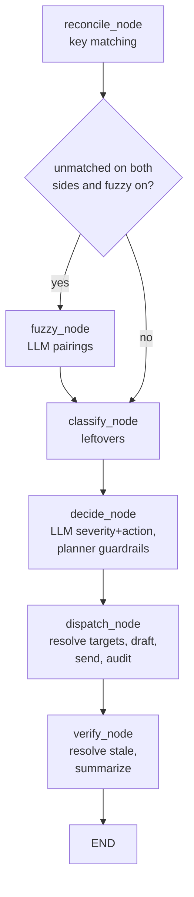

# Architecture

ReconcileFlow is a small, layered agentic system. Each layer has one job and
depends only on the layers beneath it, which keeps the deterministic core
testable in isolation from the LLM and I/O.

## Layers

| Layer | Package | Responsibility |
|---|---|---|
| Domain | `reconcile.models` | Pydantic value objects + enums; SQLAlchemy ORM |
| Parsing | `reconcile.parsers` | `.xlsx`/`.csv` → validated models, row-level errors |
| Reconciliation | `reconcile.reconciliation` | Deterministic matching, SLA, routing rules |
| Agent | `reconcile.agent` | LLM client, planner, verifier, LangGraph, orchestration |
| Notifications | `reconcile.notifications` | Notifiers + retry + circuit breaker + dispatch |
| Audit | `reconcile.audit` | Run lifecycle, append-only events, idempotency |
| Incidents | `reconcile.incidents` | Failure records + deterministic severity + admin notify |
| Interface | `reconcile.api`, `reconcile.cli` | FastAPI web app and Typer CLI |

## System view

```mermaid
flowchart LR
    U[Browser / CLI] -->|2 files| API[FastAPI]
    API --> P[Parsers]
    P --> AG[LangGraph agent]
    AG --> LLM[(Groq LLM / mock)]
    AG --> N[NotificationService]
    N --> R[(Resend / SMTP / Mock)]
    AG --> DB[(SQLite)]
    AG --> INC[(Incidents JSON/JSONL)]
    API --> M["/metrics, /runs/&#123;id&#125;"]
```

## Agent state machine

The agent is a LangGraph `StateGraph`. State carries data only; runtime
collaborators are injected via `AgentDependencies` and bound into each node with
`functools.partial`.

Node responsibilities:

- **reconcile_node** — deterministic key matching; produces matched pairs, key
  exceptions (amount/duplicate), and leftovers.
- **fuzzy_node** — asks the LLM to pair leftover orders↔settlements; auto-applies
  `confidence ≥ 0.85`, routes `0.5–0.85` to admin as `FUZZY_MATCH_REVIEW`.
- **classify_node** — turns remaining leftovers into cash/online-missing, late,
  and unmatched-settlement exceptions (SLA-aware).
- **decide_node** — per exception, the LLM returns `(severity, action,
  rationale)`; the planner validates the action against the allow-list (off-list
  or invalid `WAIT` → `ESCALATE`).
- **dispatch_node** — resolves recipient targets, drafts and sends one email per
  target (idempotently, through the breaker), records audit + exception
  lifecycle. `WAIT` sends nothing; `ESCALATE` emails admin.
- **verify_node** — marks previously-open exceptions absent this run as
  `RESOLVED`, then builds the run summary.

## Determinism boundary

Everything except three node behaviors is deterministic Python:

- fuzzy pairing **proposals** (`fuzzy_node`),
- per-exception severity + action **proposals** (`decide_node`),
- email **drafting** (`dispatch_node`).

All three are validated/guarded before they affect anything: pairings pass
through confidence thresholds, actions through the planner allow-list, and email
text is plain-text only. Matching, amounts, audit writes, and incident severity
never touch the LLM.

## Persistence

`SQLite` (via SQLAlchemy 2) holds `run_log`, `audit_log`, `notification_log`
(unique on `mismatch_key + recipient_email`), and `exception_log`. Incidents are
JSON files plus an append-only `incidents.jsonl`. All of it lives under a single
configurable `DATA_DIR`.
